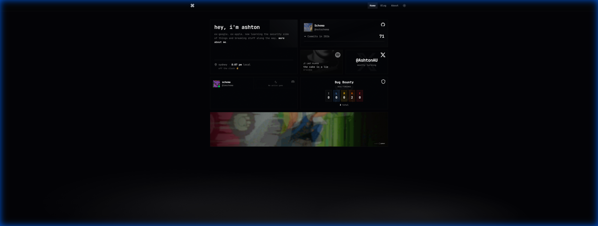
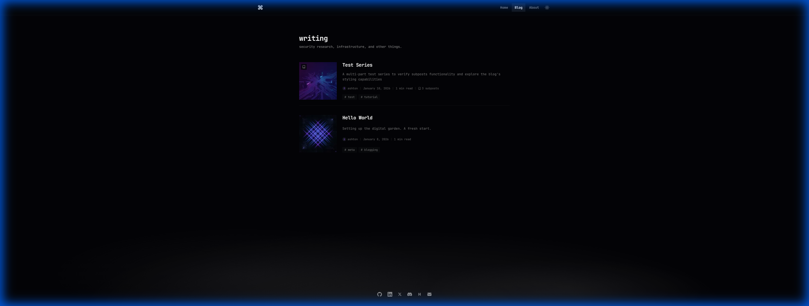
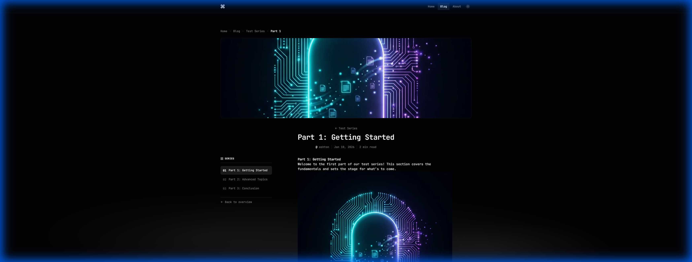

# ashton.com.au

A modern, high-performance personal portfolio and digital garden. Built with [Astro](https://astro.build), [React](https://react.dev), and [Tailwind CSS](https://tailwindcss.com).

> **Note**: This project is open source and designed to be forked! Feel free to clone it, modify it, and make it your own. If you use it, I'd appreciate a small credit or shoutout.



## 📸 Showcase

### Homepage

A responsive bento grid layout with interactive components.


### Blog & Reading Experience

Optimized for readability with premium typography, table of contents, and series support.

<div align="center">
  
  
</div>

### About & Authors

Rich author profiles and storytelling pages.

<div align="center">
  
  
</div>

## ✨ Features

- **Interactive Bento Grid**: Real-time status components (GitHub, Discord, Spotify, RetroTV)
- **Advanced Blog System**: MDX, series/subposts support, tags, and authors
- **Search**: Fast, static search powered by Pagefind (`Cmd+K`)
- **Premium UI**: Dark mode, pixel trails, smooth transitions, and high-end typography
- **Performance**: Static site generation (SSG) with selective React hydration

## 🛠️ Stack

- **Framework**: Astro v5
- **UI Architecture**: React 19
- **Styling**: Tailwind CSS v4
- **Search**: Pagefind
- **Deployment**: Vercel

## 🚀 Getting Started

Want to use this for your own site?

1.  **Clone the repo**

    ```bash
    git clone https://github.com/AshtonAU/ashton.com.au.git
    cd ashton.com.au
    ```

2.  **Install dependencies**

    ```bash
    npm install
    ```

3.  **Start development server**

    ```bash
    npm run dev
    ```

4.  **Configure environment**
    Create a `.env` file for optional features:
    ```env
    PUBLIC_GIPHY_API_KEY=your_key
    GITHUB_TOKEN=your_token
    ```

## 🤝 attribution

If you use this codebase for your portfolio:

1.  Please keep the **LICENSE** file.
2.  A link back to [ashton.com.au](https://ashton.com.au) or [github.com/AshtonAU](https://github.com/AshtonAU) in your footer or README is appreciated!

## 📄 License

MIT © 2026 Ashton Turner
