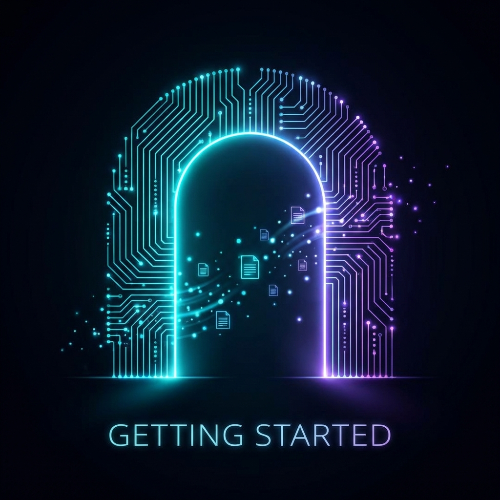

# Part 1: Getting Started

Welcome to the first part of our test series! This section covers the fundamentals and sets the stage for what's to come.



## Introduction

This is the first subpost in the test series. Here we'll explore basic concepts and lay the groundwork for more advanced topics.

### What You'll Learn

- Understanding the basics
- Setting up your environment
- First steps with the technology

## Features to Verify

The sidebar on the left demonstrates our subposts navigation:

- ✅ Subposts sidebar shows on the left
- ✅ Current part is highlighted
- ✅ "Back to overview" link works
- ✅ Table of Contents is hidden (subposts take priority)

## Core Concepts

Let's dive into some fundamental concepts that you'll need to understand.

### Concept 1: The Foundation

Every great project starts with a solid foundation. Here's what that means in practice:

```bash
# Initialize your project
npm init -y
npm install dependencies
```

The command above sets up your basic project structure.

### Concept 2: Configuration

Configuration is key to customization. Here's an example configuration:

```json
{
  "name": "my-project",
  "version": "1.0.0",
  "settings": {
    "theme": "dark",
    "language": "en"
  }
}
```

## Key Takeaways

> **Remember:** The basics are important! Don't skip this section even if you're experienced.

| Concept        | Importance | Difficulty |
| -------------- | ---------- | ---------- |
| Foundation     | High       | Low        |
| Configuration  | Medium     | Medium     |
| Best Practices | High       | Low        |

---

**Next up:** In [Part 2](/blog/test-series/part-2), we'll explore more advanced topics!
