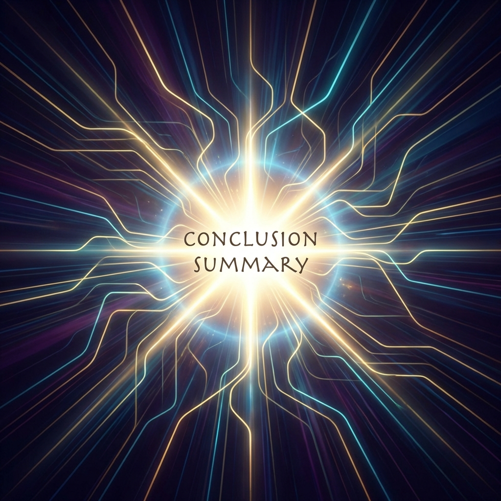

# Part 3: Conclusion

Congratulations on making it to the final part of this test series! Let's summarize what we've learned and look at next steps.



## Series Recap

Throughout this series, we've covered a lot of ground:

### Part 1: Getting Started

We laid the foundation with core concepts and basic setup.

### Part 2: Advanced Topics

We dove deep into advanced patterns, best practices, and performance considerations.

### Part 3: Conclusion

Now we're wrapping up with a summary and key takeaways.

## What We Learned

Here's a comprehensive checklist of everything verified:

- ✅ Subposts navigation works seamlessly
- ✅ Parent/child relationships detected automatically
- ✅ Sidebar shows current position clearly
- ✅ Grid layout adapts based on post type
- ✅ Featured images display correctly
- ✅ Code blocks have proper syntax highlighting
- ✅ Tables render with appropriate styling
- ✅ All heading levels are styled correctly

## Key Takeaways

> **The most important lesson:** A well-structured blog with proper navigation dramatically improves user experience.

| Aspect     | Before         | After                  |
| ---------- | -------------- | ---------------------- |
| Navigation | Manual links   | Auto-generated sidebar |
| Discovery  | Hidden content | Clear series structure |
| UX         | Confusing      | Intuitive              |

## Final Thoughts

This series demonstrated how powerful a modern blog system can be when properly configured:

1. **Content organization** - Subposts make long-form content digestible
2. **Visual hierarchy** - Proper headings guide readers
3. **Rich media** - Images enhance understanding
4. **Code examples** - Technical content is properly highlighted

```python
# Final example
def celebrate():
    print("🎉 Series complete!")
    return "Thanks for reading"

celebrate()
```

## What's Next?

Now that you've seen how the blog system works, here are some ideas for next steps:

- Create your own series on a topic you're passionate about
- Experiment with different media types
- Share your content with the community

---

**Thank you for following along!**

Feel free to [go back to the overview](/blog/test-series) or explore other posts on the blog.
